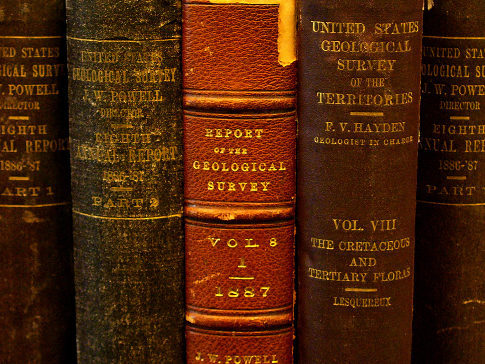

## 前文

日本国及びアメリカ合衆国は、両国の間に伝統的に存在する平和及び友好の関係を強化し、並びに民主主義の諸原則、個人の自由及び法の支配を擁護することを希望し、また、両国の間の一層緊密な経済的協力を促進し、並びにそれぞれの国における経済的安定及び福祉の条件を助長することを希望し、国際連合憲章の目的及び原則に対する信念並びにすべての国民及びすべての政府とともに平和のうちに生きようとする願望を再確認し、両国が国際連合憲章に定める個別的又は集団的自衛の固有の権利を有していることを確認し、両国が極東における国際の平和及び安全の維持に共通の関心を有することを考慮し、相互協力及び安全保障条約を締結することを決意し、よって、次のとおり協定する。

## 第一条

締約国は、国際連合憲章に定めるところに従い、それぞれが関係することのある国際紛争を平和的手段によって国際の平和及び安全並びに正義を危うくしないように解決し、並びにそれぞれの国際関係において、武力による威嚇又は武力の行使を、いかなる国の領土保全又は政治的独立に対するものも、また、国際連合の目的と両立しない他のいかなる方法によるものも慎むことを約束する。

締約国は、他の平和愛好国と協同して、国際の平和及び安全を維持する国際連合の任務が一層効果的に逐行されるように国際連合を強化することに努力する。

<!-- %%onecolumn%% -->

## 第二条

締約国は、その自由な諸制度を強化することにより、これらの制度の基礎をなす原則の理解を促進することにより、並びに安定及び福祉の条件を助長することによって、平和的かつ友好的な国際関係の一層の発展に貢献する。締約国は、その国際経済政策におけるくい違いを除くことに努め、また、両国の間の経済的協力を促進する。

<!-- %%twocolumn%% -->

## 第三条

締約国は、個別的及び相互に協力して、継続的かつ効果的な自助及び相互援助により、武力攻撃に抵抗するそれぞれの能力を、憲法上の規定に従うことを条件として、維持し発展させる。

## 第四条

締約国は、この条約の実施に関して随時協議し、また、日本国の安全又は極東における国際の平和及び安全に対する脅威が生じたときはいつでも、いずれか一方の締約国の要請により協議する。

